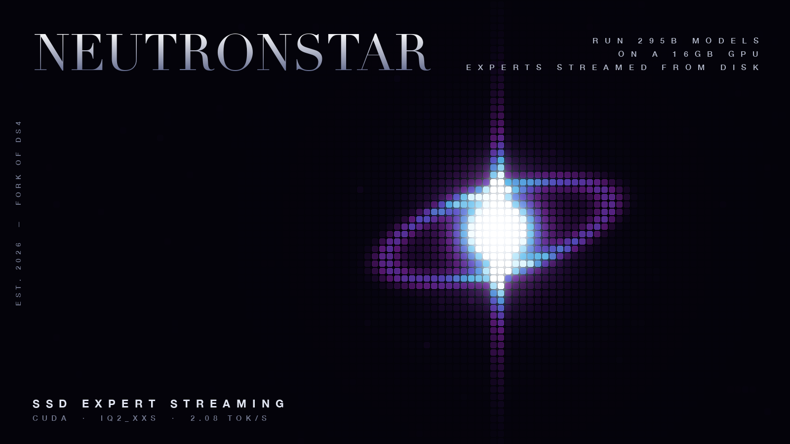

# NeutronStar: giant MoE models on a single consumer GPU



A fork of [antirez/ds4](https://github.com/antirez/ds4) (DwarfStar) that runs
frontier Mixture-of-Experts language models on a GPU that has no business
running them: the routed experts are streamed from SSD on every token while
attention and shared weights stay resident. Three model families run through
one engine, dispatched by the GGUF arch string; two are proven end to end on
one **RTX 4060 Ti 16GB** today:

- **GLM-5.2** (743B MoE): CUDA port of the whole GLM path, the SSD-streaming
  optimization stack, and the first MTP speculative-decoding implementation for
  GLM-5.2 on any backend. ~0.40 tok/s generation, ~6.5 t/s long-prompt prefill.
  The 196.6 GiB file streams routed experts per token while ~20 GiB of
  attention/shared weights stay resident.
- **Tencent Hy3** (295B / 21B-active MoE): a new grouped-query attention path
  (ds4 was MLA-only), a ds4-native 2-bit quant, interactive chat with KV
  retained across turns, and speculative cross-layer expert prefetch (the
  next layer's router runs early so the SSD reads its experts while the GPU
  is still on the current layer). ~2.1 tok/s generation, ~6.1 t/s
  long-prompt batch prefill on the same card.
- **DeepSeek 4 / 4 Flash**: upstream ds4's original target, inherited intact
  (MLA attention, DSA sparse indexer); the GLM CUDA work runs on the same
  MLA plumbing.

Reference machine: RTX 4060 Ti 16GB, 32GB DDR5, Ryzen 9900X, one NVMe. The GLM
campaign arc was 0.05 → 0.40 t/s generation and 0.30 → 6.5 t/s prefill on
identical hardware, all software. HuggingFace tells you a 4060 Ti cannot run
these models. HuggingFace is wrong, just slowly.

This is `main`: every supported architecture lives here, and the engine
dispatches on the GGUF arch string (`glm-5.2`, `hy-v3`) at load time. New
model bring-ups happen on feature branches and land here when they work.

## The model

Grab the matching quant (antirez's official ds4 build, mirrored with full
per-tensor recipe documentation; uniform-slab routed experts, MTP layer
included in the main file):

**[huggingface.co/giannisan/GLM-5.2-ds4-gguf](https://huggingface.co/giannisan/GLM-5.2-ds4-gguf)**
(bit-identical to [antirez/GLM-5.2-GGUF](https://huggingface.co/antirez/GLM-5.2-GGUF))

Recipe in that card. Short version: all routed experts uniform IQ2_XXS (the
streaming cache uses fixed-size slabs and the dp4a kernels decode IQ2_XXS
directly), everything that makes decisions stays at Q8_0/F32, and blk.78 (the
MTP draft layer) rides along at Q2_K inside the same file.

For Hy3, grab:

**[huggingface.co/giannisan/Hy3-ds4-gguf](https://huggingface.co/giannisan/Hy3-ds4-gguf)**

Same slab layout: routed experts uniform IQ2_XXS, attention and shared experts
Q8_0, the nextn/MTP layer (blk.80) at Q2_K. Quantized to the ds4-native layout
with the `hy-v3` arch string; a from-BF16 rebuild is in progress. Recipe and
provenance are in the card. Both models live in the
[NeutronStar collection](https://huggingface.co/collections/giannisan/neutronstar-6a509f2cc7cac276b1f066e0).

## What this fork adds over upstream

### Tencent Hy3 (295B) support
ds4 was built entirely around MLA-family attention. Hy3 is Qwen3-shaped: plain
grouped-query attention (64 query / 8 KV heads, head_dim 128) with per-head
QK-RMSNorm and NeoX RoPE, a 192-expert top-8 sigmoid router with expert bias, a
shared expert, and a leading dense layer. This branch adds the GQA path ds4
never had, in `ds4_cuda_gqa.inc`: per-head weighted QK-RMSNorm, rotate-half
RoPE, a per-KV-head FP32 KV cache, and a single-pass online-softmax causal GQA
kernel, all validated against a CPU reference by `ds4 --gqa-selftest` (no model
file needed). The router, streaming expert cache, shared expert, dense layer,
and nextn/MTP-layer handling are reused from the GLM plumbing. Result: Hy3 runs
end to end with interactive chat, ~2.1 tok/s. The engine recognizes the model
from the `hy-v3` GGUF arch string.

### GLM-5.2 CUDA port
Upstream runs GLM-5.2 on Metal. This branch makes the whole GLM path work on
CUDA: MLA attention, DSA sparse indexer, compact KV, indexed prefill, and the
routed-MoE kernels, including new IQ2_XXS dp4a down-projection kernels (upstream
had Q2_K down only).

### SSD streaming optimizations (the 0.05 → 0.40 arc)
- **Parallel fetch backfill** for expert-cache misses: 0.6 → 1.75 GB/s effective
  disk feed (measured at ~89% of the PCIe link ceiling).
- **io_uring + O_DIRECT fetch engine** (QD 64, `DS4_CUDA_FETCH_URING=1`), with a
  buffered-mode escape hatch (`DS4_CUDA_FETCH_BUFFERED=1`) for models that fit
  mostly in page cache.
- **Aligned buffer recycling pool** (kills per-fetch mmap churn).
- **Host expert cache with LFU eviction**: expert popularity is concentrated
  enough that the hottest ~4% of experts serve ~30% of lookups, so a 7 GiB RAM
  cache removes ~30% of all disk traffic (`DS4_CUDA_HOST_EXPERT_CACHE_GB`).
- **Host-cache warm start** (`DS4_CUDA_HOST_CACHE_STATE=file`): the cache
  index (offsets, sizes, hit counts; ~200KB, never the 16GB of data) persists
  across runs, and a background thread re-reads the entries in offset order
  at startup: 12.2 GiB warm in 13 s. Sessions open at ~84% hit rate on the
  first 2048 lookups instead of ~59% cold and minutes of climbing.
- **Cross-layer expert prefetch** (Fate-style router lookahead,
  `DS4_GLM_EXPERT_PREFETCH=1`): run layer N+1's router on layer N's hidden
  state and read the predicted experts while the GPU is still computing.
  Throughput-neutral on GLM while the drive was saturated (x1 link days);
  on Hy3 with a full Gen4 x4 link it delivers **1.72 → 2.08 t/s (+21%)**,
  host-cache hit rate 63% → 89%, disk busy 40% → 63%. Deeper lookahead via
  `DS4_EXPERT_PREFETCH_DEPTH` (depth 2 loses on this drive: mispredicted
  reads steal bandwidth demand fetches need; armed for Gen5).

### MTP speculative decoding for GLM 5.2 (first implementation anywhere)
GLM-5.2 ships a draft head (blk.78) that no backend had wired up. This branch:
- binds it from the main gguf (no separate draft file, pass the same path to
  `--mtp`),
- runs it as a single-token predictor: measured **95% next-token hit rate** at
  temp 0,
- chains it recursively: d2 hits 61% conditional; depth 2 is the useful maximum
  (`DS4_GLM_MTP_DEPTH`),
- includes an accept loop (`DS4_GLM_MTP_ACCEPT=1`) with 2-token batch
  verification. The batch MoE kernels address whole expert tensors through
  model views, which under streaming OOM'd 30GB hosts;
  `DS4_GLM_INDEXED_PER_EXPERT_FFN=1` reroutes small indexed batches through
  the decode expert cache (only the selected experts load, per token), which
  makes the accept loop run within a decode-sized memory budget. Probe mode
  (`DS4_MTP_PROBE=1`) works everywhere.

  Status (measured, 30GB host): the loop runs correctly end to end
  (`batches=16 accepted=3 tokens=20`, byte-identical output) but is a net
  slowdown, and the reason is structural, not an implementation gap.
  Verify evals cost the same as decode evals (3.2 vs 3.1 s), because ~70%
  of an eval is fetching that token's own expert set off disk, and two
  rows' expert selections barely overlap (~10-20%). Speculative decoding
  wins by sharing weight reads across batch rows; a disk-streaming MoE has
  almost nothing to share, so every speculated token drags its own ~5GB
  through the drive. Even with union expert loads across the verify rows,
  a 2-token batch costs ~1.85 evals and yields 1+p tokens: at the
  probe-measured d2 rate (p=0.61) that is 1.15 evals/token, still worse
  than plain decode. MTP accept pays off in resident-weight regimes (like
  ds4 Flash), not in expert-streaming ones; revisit only once disk stops
  dominating. Also open: d2 acceptance measures 19% through the
  indexed-attention verify vs 61% in probe mode against full-attention
  decode; near-tie argmax flips between the two attention paths are the
  suspect.

### Latent CUDA-streaming bugs fixed along the way
Nobody had run interactive GLM sessions on CUDA streaming before, and it showed:
- the split batch-attention fast path hard-required the f16 compact cache
  (Apple-only) and silently killed any indexed batch on CUDA (f32 cache),
- every model-span install released the entire CUDA weight cache, forcing
  multi-GiB rebuilds per step in batch paths (installs are now skipped while the
  static decode map is live),
- the uniform-Q2_K expert-cache gate would overrun IQ2_XXS-sized cache slabs
  with a mixed-quant model (now slab-budget checked),
- session resume (chat turn 2+) routed into the batch prefill and OOM'd 30GB
  hosts (now token-major for small suffixes),
- the batch MoE expert-tile kernels loaded the IQ2 dequant LUTs into shared
  memory only for models with n_embd <= 4096 (16 q8_K blocks) but consumed
  them unconditionally: GLM's 7168 embd (28 blocks) dequantized gate/up
  against uninitialized shared memory. Every multi-token batch produced
  fluent garbage at full speed, and the MTP verify (n=2, same kernels)
  returned corrupt logits. Upstream-affecting: any n_embd > 4096 model on
  the CUDA batch path. Fixed by hoisting the LUT loads; submitted upstream
  as antirez/ds4#513.

### Long-prompt prefill: 0.30 -> 6.5 t/s on GLM (21x), 0.62 -> 6.1 t/s on Hy3 (10x)
Hy3 batch prefill processes the prompt in chunks (default 256 tokens,
`DS4_HY3_PREFILL_CHUNK`); each layer's chunk-wide expert union loads in one
disk pass, so the same bytes serve up to 256 tokens instead of one. Chunk
scaling on a ~1900-token prompt: 64 -> 2.77, 128 -> 4.17, 256 -> 6.06 t/s
(the per-layer union saturates near the full expert set, so bigger chunks
are nearly free tokens). Output is correct but not bit-identical to
token-major prefill: the batch kernels quantize activations on a different
path, so near-tie argmax picks can flip (same contract as GLM batch
prefill).

With the LUT fix, GLM batch prefill works and is transformative: a 600-token
prompt prefills at **6.5 t/s** vs 0.30 t/s token-major, because a chunk's
tokens per layer collectively route to most of the 256 experts, so one
full-layer sequential read serves the whole chunk (~350MB/token at chunk 256
vs 5.4GB/token single). Prompts <= 64 tokens still run token-major by
design. This is the same expert-overlap physics that makes speculative
decoding unprofitable here, with the sign flipped: overlap is near-zero
across 2 speculative tokens and near-total across a 600-token chunk. A full
4k-context paste is ~10 minutes on a Gen4 x4 drive today.

Plus `DS4_CUDA_ARENA_VRAM_RESERVE_GB` to keep VRAM headroom for batch kernels.

## Quick start

```sh
git clone https://github.com/giannisanni/neutronstar
cd neutronstar && make cuda CUDA_ARCH=sm_89

# GLM-5.2 (743B)
M=GLM-5.2-UD-IQ2_XXS_RoutedIQ2XXS_blk78Q2K.gguf
DS4_GLM_CUDA_UNSAFE=1 DS4_CUDA_HOST_EXPERT_CACHE_GB=7 DS4_CUDA_PARALLEL_FETCH_THREADS=16 \
./ds4 -m $M --cuda --ssd-streaming --ssd-streaming-cache-experts 64 \
  --ctx 4096 --tokens 400 --nothink -p "Tell me something surprising about Suriname."

# Tencent Hy3 (295B)
H=Hy3-ds4-IQ2XXS-AttnQ8.gguf
DS4_CUDA_HOST_EXPERT_CACHE_GB=16 DS4_CUDA_PARALLEL_FETCH_THREADS=16 \
./ds4 -m $H --cuda --ssd-streaming --ssd-streaming-cache-experts 64 \
  --ctx 4096 --tokens 400 --nothink -p "Tell me something surprising about Suriname."

# interactive chat (Ollama-style): drop -p on either model
# GLM MTP probe telemetry: add --mtp $M with DS4_MTP_PROBE=1 DS4_MTP_STREAMING_UNSAFE=1
```

Memory sizing on a 30GB host: the resident weights want ~9-13 GiB VRAM plus
~8 GiB pinned host RAM; give the expert cache whatever is left minus a few GiB
of headroom (7 GiB cache is the knife-edge, 5 is comfortable).

## Environment knobs added by this branch

| Env | Default | What it does |
|---|---|---|
| `DS4_CUDA_HOST_EXPERT_CACHE_GB` | 0 | LFU host RAM cache for routed experts |
| `DS4_CUDA_PARALLEL_FETCH_THREADS` | 16 | expert fetch worker threads |
| `DS4_CUDA_FETCH_URING` / `DS4_CUDA_FETCH_QD` | on / 64 | io_uring O_DIRECT fetch engine |
| `DS4_CUDA_FETCH_BUFFERED` | 0 | page-cache reads (models ≲ RAM × small multiple) |
| `DS4_GLM_EXPERT_PREFETCH` | 0 | cross-layer router-lookahead prefetch |
| `DS4_GLM_MTP_DEPTH` | 4 | draft chain depth (2 is the useful max) |
| `DS4_GLM_MTP_ACCEPT` | 0 | experimental speculative accept loop (needs `--mtp` + `--temp 0`) |
| `DS4_GLM_INDEXED_PER_EXPERT_FFN` | 0 | small indexed batches load selected experts per token instead of whole tensors |
| `DS4_MTP_PROBE` | 0 | draft hit-rate telemetry |
| `DS4_CUDA_ARENA_VRAM_RESERVE_GB` | 0 | VRAM headroom the weight arena must not eat |
| `DS4_GLM_SYNC_TRACE` | 0 | session prefill branch tracing |

## Roadmap on this branch

The bottleneck is memory bandwidth and disk, not GPU compute. Next levers:
Gen5 NVMe (drive-limited today: the engine runs at ~89% of the link ceiling),
more host RAM (bigger LFU expert cache: 16 GiB gets Hy3 to a 68% hit rate),
and **multi-GPU expert residency** (hold a large fraction of experts in VRAM
across several cards, ~30x faster than disk streaming; the reason to add a
second and third 16GB GPU). Further out: GPU-initiated NVMe reads (BaM-style;
simulator already passing, design in `docs/gpu-nvme-design.md`), and a from-BF16
canonical Hy3 quant. MTP notes in `docs/glm-mtp-port.md`; on streaming MoE the
accept loop is net-negative until the disk stops being the bottleneck.

## Relation to upstream

Everything here builds on [antirez/ds4](https://github.com/antirez/ds4), which
in turn stands on llama.cpp/GGML. The `flash-local` branch carries the subset of
this work that applies to DeepSeek V4 Flash. The original upstream README is
preserved as `README.upstream.md`.
